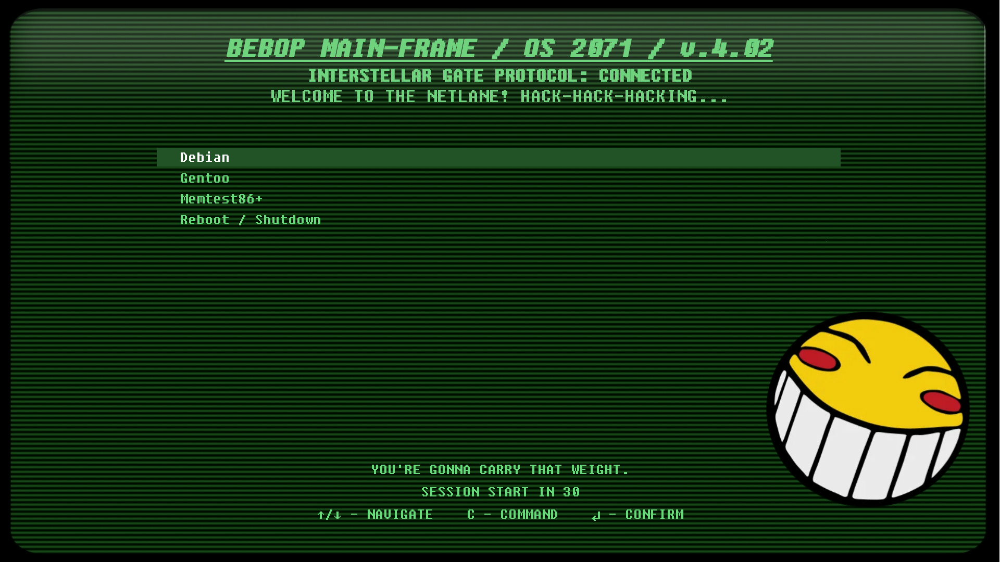
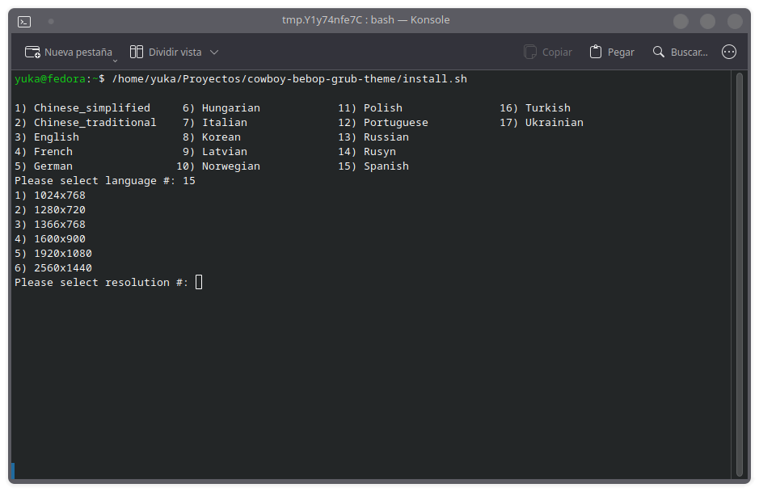
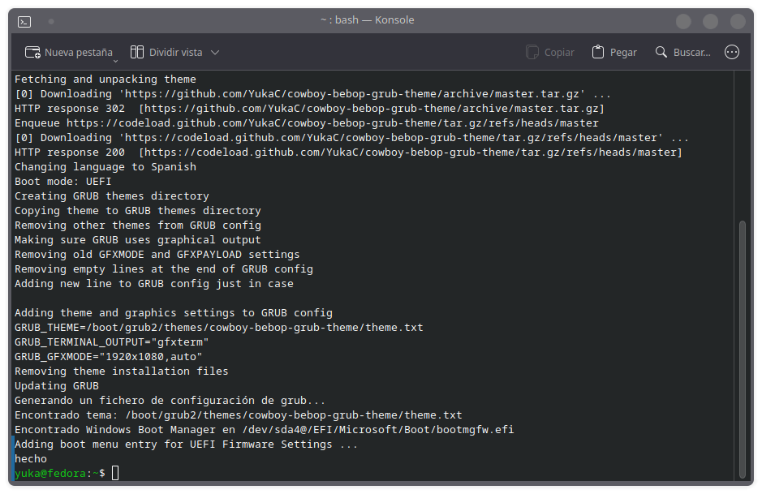

## Cowboy Bebop GRUB Theme

A Cowboy Bebop-inspired GRUB bootloader theme with Edward's terminal aesthetic — green CRT scanlines, retro monospace font, and iconic quotes from the series.

> Fork of [Fallout GRUB Theme](https://github.com/shvchk/fallout-grub-theme) by [shvchk](https://github.com/shvchk)



### Features

- 🖥️ Edward-style green CRT terminal aesthetic
- 🎵 Iconic Cowboy Bebop quotes ("YOU'RE GONNA CARRY THAT WEIGHT.")
- 🌍 17 languages supported
- 📐 Responsive layout for multiple resolutions

**Supported languages:** Chinese (simplified), Chinese (traditional), English, French, German, Hungarian, Italian, Korean, Latvian, Norwegian, Polish, Portuguese, Russian, Rusyn, Spanish, Turkish, Ukrainian

---

### Installation / update

- **Secure way:**
  - Download install script:

    ```sh
    # Using wget
    wget -P /tmp https://github.com/YukaC/cowboy-bebop-grub-theme/raw/master/install.sh

    # Or using curl
    curl -fsSL -o /tmp/install.sh https://github.com/YukaC/cowboy-bebop-grub-theme/raw/master/install.sh
    ```

  - Review it at `/tmp/install.sh`

  - Run it:

    ```sh
    bash /tmp/install.sh
    ```

- **Easier, less secure way** — just download and run install script:

  ```sh
  # Using wget
  wget -O - https://github.com/YukaC/cowboy-bebop-grub-theme/raw/master/install.sh | bash

  # Or using curl
  curl -fsSL https://github.com/YukaC/cowboy-bebop-grub-theme/raw/master/install.sh | bash
  ```

<br>

The installer will prompt you to select a **language** and a **screen resolution** interactively.






You can use `--lang` option to select language and disable interactive language selection, e.g.:

```sh
bash /tmp/install.sh --lang German
```

or

```sh
wget -O- https://github.com/YukaC/cowboy-bebop-grub-theme/raw/master/install.sh | bash -s -- --lang Korean
```

Full list of languages see in `INSTALLER_LANGS` variable in [install.sh](install.sh)

---

### Uninstallation

To remove the theme and restore default text-mode GRUB:

```sh
bash /tmp/install.sh --uninstall
```

This will remove the theme files, clean GRUB configuration, and restore the default text terminal.

---

### Credits

- Original theme by [shvchk](https://github.com/shvchk/fallout-grub-theme)
- Cowboy Bebop adaptation by [YukaC](https://github.com/YukaC)
- Font: [Fixedsys Excelsior](http://www.fixedsysexcelsior.com/)

---

_See you space cowboy..._
